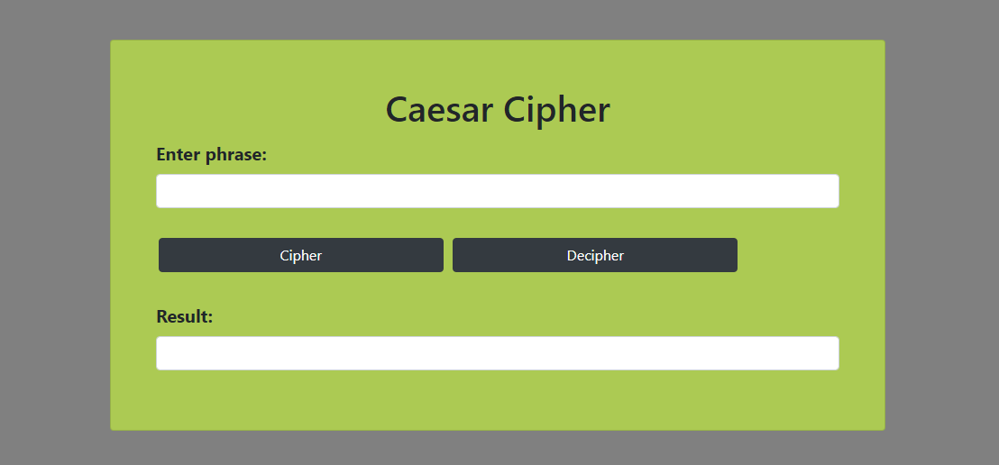

# CIFRADO CÉSAR

## Consideraciones Específicas:

1. Tu programa debe ser capaz de cifrar y descifrar tanto letras mayúsculas como minúsculas. La fórmula para descifrar es: (x - n) % 26.
2. Tu código debe estar compuesto por 2 funciones con los siguientes nombres: cipher y decipher.
3. El usuario no debe poder ingresar un campo vacío o que contenga números.
4. Tu codigo debe estar en ES6.

## Resultado:

## Autora:

### Laura Jimenez Hidalgo
